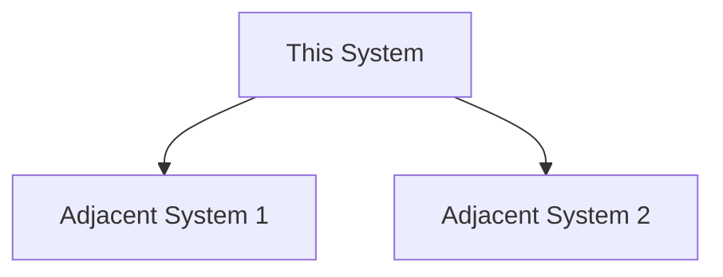

# [System Name] — System Design

> **Status:** Draft
> **Author:** [Author]

## 1. Overview

<!-- SCQA goes here. See references/examples/scqa-example.md for guidance. -->
<!-- Rewrite this section in Phase 9 once the full design is known. -->

*To be written.*

## 2. Context

<!-- Where does this system sit? What's around it? What's adjacent? -->

### 2.1 Context Diagram



### 2.2 What This System Is Not

<!-- Explicit exclusions. What might someone assume this system does, but it doesn't? -->

## 3. Jobs to Be Done

<!-- Grouped by actor. See references/examples/jtbd-example.md -->

### 3.1 [Actor 1]

### 3.2 [Actor 2]

## 4. Requirements

### 4.1 Functional Requirements

<!-- Extracted via Q&A. Each requirement should map to ≥1 JTBD. -->

### 4.2 Non-Functional Requirements

<!-- Use table format. Mark each as CONFIRMED or ASSUMED. -->

| Requirement | Value | Status | Notes |
|---|---|---|---|
| Scale | | | |
| Latency | | | |
| Availability | | | |
| Durability | | | |
| Ordering | | | |
| Auditability | | | |
| Multi-tenancy | | | |
| Extensibility | | | |

## 5. Domain Model

### 5.1 Architecture Diagram

```mermaid
graph TD
    %% Replace with actual architecture diagram
```

### 5.2 Domain Primitives

<!-- Define each entity: name, purpose, relationships -->

### 5.3 Entity Relationship Diagram

```mermaid
erDiagram
    %% Replace with actual ERD
```

## 6. Data Model

<!-- Table definitions. One subsection per table. -->
<!-- Each table gets a plain-language description. -->

## 7. Operational Flows

<!-- Sequence diagrams for each major flow. -->
<!-- Start from zero-state (blank system), through setup, to steady-state. -->

## 8. Implementation

### 8.1 Tech Stack

| Component | Choice | Rationale |
|---|---|---|
| | | |

### 8.2 API Reference

<!-- Resource-oriented. Group by resource, not by action. -->

### 8.3 Configuration

<!-- How is behavior changed without code deploys? -->

### 8.4 Activity Patterns

<!-- What does this system call out to? How? -->

## 9. Open Questions

<!-- Questions that need answers before the design is final. -->
<!-- When answered, move the answer into the relevant section. -->

## Glossary

<!-- Every domain term used in this document. -->
<!-- Each term must be verified against industry standards. -->

| Term | Definition | Source |
|---|---|---|
| | | |
